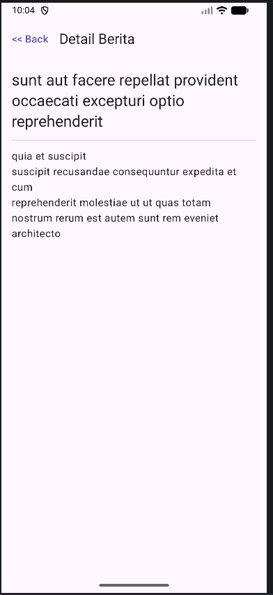
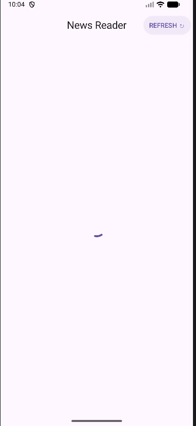
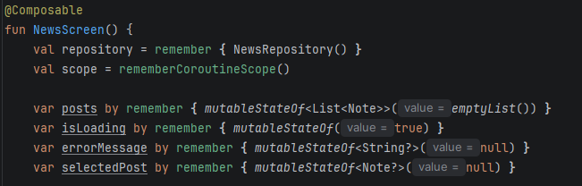

Aplikasi News Reader sederhana yang dibangun menggunakan Compose Multiplatform (KMP).
Aplikasi ini mendemonstrasikan cara mengambil data dari API publik menggunakan Ktor Client, mengelolanya dengan Repository Pattern, dan menampilkannya dalam UI Jetpack Compose yang responsif.

Fitur Utama

- Fetching Data
Mengambil data postingan/berita dari JSONPlaceholder API

- List View
Menampilkan daftar berita dalam bentuk card yang dapat di-scroll

- Detail View
Klik berita untuk melihat isi konten secara lengkap

- State Management
Menangani kondisi:
Loading
Success
Error
Refresh Data
Tombol untuk mengambil ulang data terbaru

Tech Stack & Arsitektur

Aplikasi ini mengikuti standar pengembangan modern:

Layer	Teknologi
UI	Jetpack Compose Multiplatform
Networking	Ktor Client
Serialization	Kotlinx Serialization
Architecture	Repository Pattern

Penjelasan Arsitektur
Repository Pattern
Memisahkan:
Logika pengambilan data (network)
Logika tampilan (UI)

Sehingga kode lebih:

modular
mudah di-maintain
scalable
Screenshot

Tambahkan screenshot di folder project kamu lalu tampilkan di sini

- Home (List Berita)

- Detail Berita

- Kondisi Loading

- Repository Pattern

Cara Kerja Kode
1. Model (Note.kt)
Data class dengan anotasi @Serializable
Digunakan untuk memetakan JSON dari API ke object Kotlin
@Serializable

2. Network (ApiService.kt)
Mengatur konfigurasi HttpClient
Menentukan endpoint API

4. Repository (NewsRepository.kt)
Menyediakan fungsi:
suspend fun getNews(): List<Note>

UI tidak berinteraksi langsung dengan API
Semua data diambil melalui repository

5. UI (NewsScreen.kt)
- Pengambilan Data

Menggunakan LaunchedEffect saat pertama kali layar dibuka:

- State Management

Untuk menyimpan:

daftar berita
status loading
pesan error

- Tampilan List

Menggunakan:

LazyColumn

Agar performa tetap optimal untuk list panjang

▶️ Cara Menjalankan
Clone repository:
git clone https://github.com/username/news-reader-kmp.git
Buka di Android Studio / IntelliJ
Jalankan project sesuai target platform:
Android
Desktop (jika tersedia)
